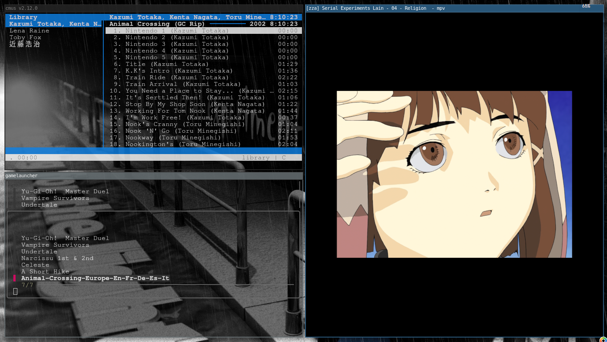

# My Arch Linux Dotfiles

Ma configuration Arch Linux avec i3.

## Screenshot



## Installation

Installer les dépendances :

```bash
sudo pacman -S i3-wm kitty picom conky rofi feh ranger mpv firefox cmus rtorrent vim git
```

Cloner le dépôt :

```bash
git clone https://github.com/1STntDEV/dotfiles.git
cd dotfiles
```

Copier les configurations :

```bash
mkdir -p ~/.config

cp -r i3 ~/.config/
cp -r kitty ~/.config/
cp -r picom ~/.config/
cp -r conky ~/.config/
```

Copier les wallpapers :

```bash
mkdir -p ~/wallpaper
cp -r wallpaper/* ~/wallpaper/
```

## Firefox

Copier la configuration Firefox :

```bash
mkdir -p ~/.mozilla/firefox
cp -r firefox/* ~/.mozilla/firefox/
```

## Lancer i3

Redémarrer i3 :

```bash
i3-msg reload
i3-msg restart
```

Ou redémarrer la session.

## Structure

```
dotfiles/
├── i3/
├── kitty/
├── picom/
├── conky/
├── wallpaper/
├── firefox/
├── screenshots/
│   └── screenshot.png
└── README.md
```

